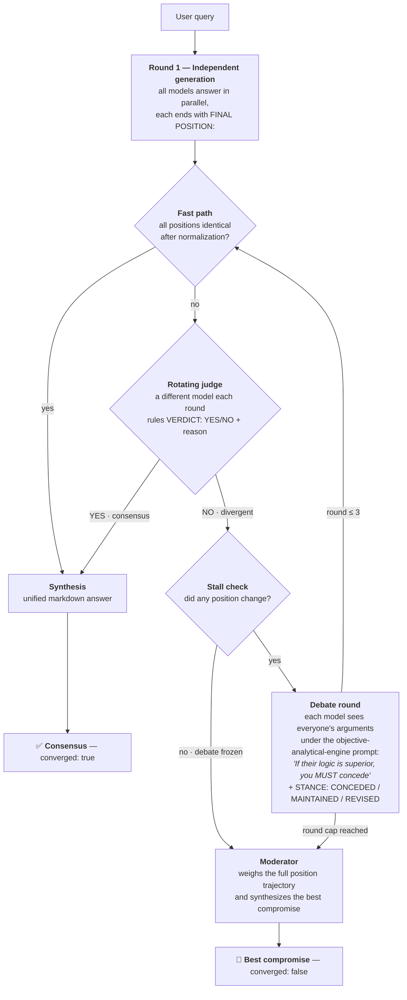

<div align="center">

# 🧠 OpenThink

### Ten minds. One answer.

**An open-source Multi-Agent Consensus Engine — stop tab-hopping between AIs. Ask once, watch them debate, get one unified answer.**

[](LICENSE)
[](backend/requirements.txt)
[](backend/app/main.py)
[](openthink/package.json)
[](openthink/tsconfig.json)
[](#-contributing)

[✨ Features](#-features) · [🚀 Quickstart](#-quickstart) · [🧠 How it works](#-how-the-consensus-engine-works) · [📡 API](#-api-reference) · [🤝 Contributing](#-contributing)

</div>

---

## 💡 The problem

You ask ChatGPT *"What's the best 34-inch curved monitor?"* — then you ask Claude, Gemini, Grok… and end up with five tabs, five different answers, and the decision is still **yours** to make.

## 🎯 The solution

**OpenThink** queries multiple AI models at once, collects their independent answers, and — if they disagree — forces them into an **objective multi-round debate** until they reach a unanimous consensus. If they can't agree within 3 rounds, a neutral **Moderator** synthesizes the best compromise.

```
You: "Is Dune a good book for someone who liked Foundation?"
        │
        ├─► ChatGPT ─┐
        ├─► Claude   │   Round 1: independent answers
        ├─► Gemini   ├─► ⚖️ Judge: "No consensus — pacing disputed"
        ├─► Grok     │   Round 2: Claude concedes to ChatGPT's argument
        └─► Kimi    ─┘   ⚖️ Judge: "Consensus reached ✅"
        │
        └─► One unified, battle-tested answer
```

## ✨ Features

| | |
|---|---|
| 🔀 **10 AI providers** | ChatGPT, Claude, Gemini, Grok, Kimi, GLM, DeepSeek, Mistral, Groq & OpenRouter — mix any subset |
| ⚡ **Parallel rounds** | All models answer simultaneously via `asyncio.gather` — the debate is as fast as the slowest model, not the sum |
| ⚖️ **Rotating judge** | A different model evaluates consensus each round, with failover to a backup judge |
| 🆓 **Zero-cost fast path** | Identical positions converge instantly — no extra API calls spent |
| 🏳️ **Honest concessions** | Models must declare `CONCEDED to X` / `MAINTAINED` / `REVISED` — visible in the timeline |
| 🛑 **Stall detection** | If nobody changes their mind, the debate skips straight to the Moderator instead of burning tokens |
| 🧑‍⚖️ **Moderator failsafe** | Hard 3-round cap; the Moderator weighs the full position trajectory and decides |
| 🔑 **Bring your own keys** | Keys live only in browser memory for the session — never in localStorage, never on a server |
| 🎨 **Minimalist dark UI** | ChatGPT-inspired interface with a live debate timeline, SSE streaming, and keyboard shortcuts |
| 🧪 **Battle-tested engine** | The orchestration core ships with end-to-end mocked tests |

## 🎭 Supported providers

| Provider | Models (default first) |
|---|---|
| 🟢 **OpenAI** — ChatGPT | `gpt-5.6-luna`, `gpt-5.6-terra`, `gpt-5.6-sol`, `gpt-5.4-mini` |
| 🟠 **Anthropic** — Claude | `claude-haiku-4-5`, `claude-sonnet-5`, `claude-opus-5`, `claude-fable-5` |
| 🔵 **Google** — Gemini | `gemini-3.5-flash-lite`, `gemini-3.6-flash`, `gemini-3.7-flash`, `gemini-3.1-pro-preview` |
| ⚫ **xAI** — Grok | `grok-4.3`, `grok-4.6`, `grok-4.5`, `grok-4.20-non-reasoning`, `grok-build-0.1` |
| 🟣 **Moonshot** — Kimi | `kimi-k2.6`, `kimi-k3`, `kimi-k2.7-code`, `kimi-k2.7-code-highspeed` |
| 🩵 **Zhipu** — GLM | `glm-4.7-flash`, `glm-4.7`, `glm-5.2`, `glm-5.3-flash`, `glm-5.3` |
| 🔷 **DeepSeek** | `deepseek-v4-flash`, `deepseek-v4-pro` |
| 🟧 **Mistral** | `mistral-small-latest`, `mistral-medium-latest`, `mistral-large-latest`, `magistral-medium-latest` |
| 🟥 **Groq** | `openai/gpt-oss-20b`, `openai/gpt-oss-120b`, `qwen/qwen3.6-27b` |
| 🟪 **OpenRouter** | `openai/gpt-5-nano`, `anthropic/claude-sonnet-5`, `anthropic/claude-opus-5`, `openai/gpt-5.6-terra`, `google/gemini-3.1-pro-preview`, `deepseek/deepseek-v4-pro` |

> 💡 The first model of each row is the default (fast/cheap, suited to orchestration); the rest include each provider's **frontier flagships**. Override any default with an env var, e.g. `OPENTHINK_MODEL_OPENAI=gpt-5.6-sol` — or pick the variant per-provider in the UI's settings drawer.

## 🚀 Quickstart

**Prerequisites:** Python 3.12+ and Node 18+ (with pnpm or npm).

### 1️⃣ Backend — the debate engine

```bash
cd backend
python -m venv venv

# Windows (Git Bash):
./venv/Scripts/python.exe -m pip install -r requirements.txt
# macOS/Linux:
# source venv/bin/activate && pip install -r requirements.txt

uvicorn app.main:app --port 8000
```

### 2️⃣ Frontend — the interface

```bash
cd openthink
pnpm install        # or: npm install
pnpm dev            # → http://localhost:5173 (proxies /api → :8000)
```

### 3️⃣ Debate

1. Open `http://localhost:5173` and click the **⚙️ gear** (or press `Ctrl+,`).
2. Paste API keys for any subset of providers — the **Test** button verifies each one.
3. Toggle which models join the debate with the chips under the input.
4. Ask something subjective. Watch the answers stream in, the judge rule, and minds change. 🍿

> 🏭 **Single-process production:** run `pnpm build`, then start uvicorn — FastAPI serves the built frontend at `http://localhost:8000`, same-origin.

## 🧠 How the consensus engine works



| Phase | What happens |
|---|---|
| **1. Independent generation** | All active models answer simultaneously, each ending with a `FINAL POSITION:` line. |
| **2. Consensus check** | Zero-cost fast path first: identical normalized positions converge instantly. Otherwise a **rotating judge** (a different model each round, with failover to a backup) decides YES/NO with a cited reason. |
| **3. Debate rounds** | Each model receives the others' arguments under an objective-analytical-engine system prompt ("If their logic, facts, or recommendations are superior, you MUST concede…") and declares a `STANCE:` line — `CONCEDED to X`, `MAINTAINED`, or `REVISED` — shown as a pill in the timeline. |
| **4. Convergence & failsafe** | Hard cap of 3 rounds, plus **stall detection**: if no position changes in a round, the debate jumps straight to the Moderator, which synthesizes a compromise from the full position trajectory (clearly flagged as non-unanimous). |

Provider failures are isolated: a model that errors or lacks a key drops out, and the debate continues with the survivors.

## 🏛️ Architecture

```
openthink/
├── backend/                      # FastAPI — debate orchestration + provider calls
│   ├── requirements.txt
│   ├── app/
│   │   ├── main.py               # Routes, CORS, rate limiting, security headers
│   │   ├── schemas.py            # Pydantic request validation
│   │   ├── providers.py          # Async adapters for the 10 LLM providers (raw httpx, no SDKs)
│   │   ├── prompts.py            # Initial / Debate / Judge / Synthesis / Moderator prompts
│   │   └── debate.py             # The debate engine (async SSE generator)
│   └── tests/
│       └── test_debate.py        # End-to-end engine tests with a mocked provider layer
└── openthink/                    # React 19 + TypeScript + Vite + Tailwind v3 + Zustand
    └── src/
        ├── store.ts              # Zustand: persisted settings slice + debate reducer
        ├── api.ts                # SSE-over-fetch streaming client
        ├── types.ts              # ProviderId, DebateRound, SSE event types
        └── components/           # InputBar, SettingsDrawer, ConsensusView,
                                  # DebateTimeline, LoadingState, ModelChips
```

## 📡 API reference

| Endpoint | Method | Description |
|---|---|---|
| `/api/health` | GET | `{"status": "ok"}` |
| `/api/providers` | GET | Dynamic provider registry: `{"providers": [{"id", "name", "default_model", "models"}]}` |
| `/api/validate` | POST | Tests one key. Body `{"provider": "<id>", "model"?}`, key in `x-api-key-<id>` header. Always 200 with `{"ok", "latency_ms"/"error"}` |
| `/api/debate` | POST | `text/event-stream`. Body `{"query", "participants": [{"provider": "xai", "model": "grok-4.6"}, …]}`; keys via `x-api-key-<provider>` headers |

> 🧩 **Participants, not providers**: each participant is a `(provider, model)` pair, so a debate can pit **several models of the same company** against each other (e.g. `grok-4.5` vs `grok-4.6`). Identical pairs are deduplicated; participants sharing a provider share its API key.

**SSE event flow:**

```
round_start → (model_response | model_error)×N → evaluation → ⤵ repeat ≤ 3 rounds
            → moderator_start? → consensus → done
```

```jsonc
// model_response — debate rounds may carry a parsed stance
{"type":"model_response","round":2,"model":"anthropic","content":"…","duration_ms":3120,"stance":"CONCEDED to ChatGPT"}
// evaluation — includes which model judged (absent on the zero-cost fast path)
{"type":"evaluation","round":2,"consensus":true,"reason":"All final positions are identical.","judge":"anthropic"}
// consensus — converged=false means the Moderator compromise was used
{"type":"consensus","content":"…","converged":true,"rounds_used":2}
```

Rate limits: 10 debates/min and 30 validations/min per IP. CORS defaults to the Vite dev origin; override with `OPENTHINK_CORS_ORIGINS`.

## 🔐 Security & privacy

- 🔑 API keys travel **only** as request headers to **your local** backend, are held in memory for the request, and are never logged, stored, or sent to telemetry.
- 🍪 The frontend keeps keys **in memory for the session only** — nothing is written to `localStorage` (only your provider toggles and model choices are).
- 🛡️ Provider error bodies are never echoed to the browser (they can leak key fragments); the client gets sanitized messages like `invalid API key`.
- 🚦 Per-IP rate limiting, security headers on every response, and strict CORS out of the box.

## 🧪 Testing

The debate engine ships with mocked end-to-end tests — no API keys or network needed:

```bash
cd backend
python -m unittest discover tests -v
```

Covers: zero-cost consensus, concession flow with STANCE parsing, stall → Moderator shortcut, judge rotation, missing keys, and single-survivor short-circuit. Frontend: `pnpm lint` + `pnpm build` (type-check).

## 🤝 Contributing

PRs welcome! Great first contributions:

- 🌍 Add a new provider (one `ProviderConfig` entry in `providers.py`)
- 🧠 Improve the judge/moderator prompts
- 🎨 UI polish and accessibility
- 🧪 More engine tests (dropout mid-debate, judge failover…)

Please keep the engine covered by tests and the frontend lint-clean (`pnpm lint`).

## 📄 License

[MIT](LICENSE) © 2026 OpenThink contributors.

<div align="center">
<sub>Built with 🧠 by the OpenThink contributors · crafted by C-L-U</sub>
</div>
